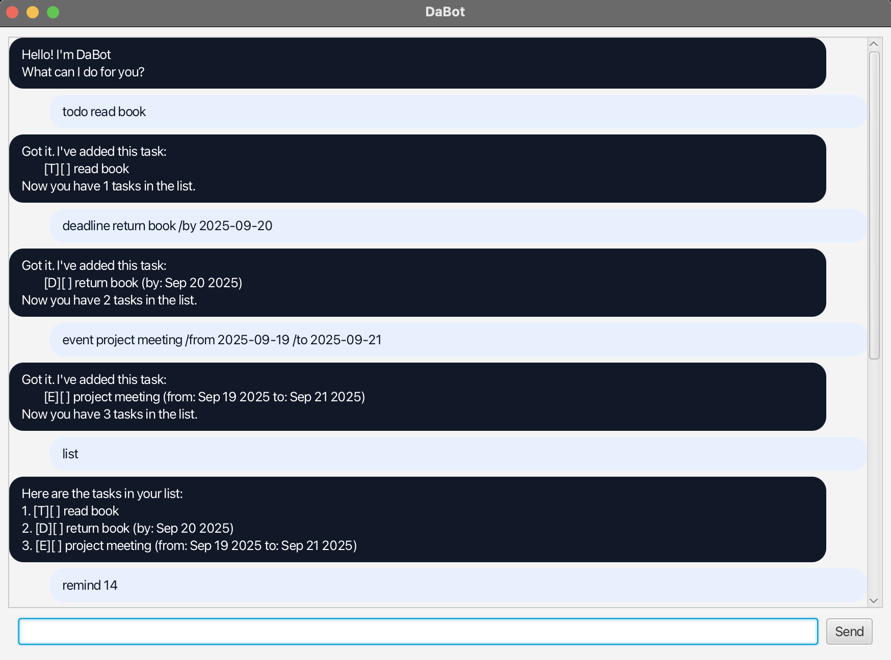

# DaBot User Guide



---

## Introduction

DaBot is a simple, personal chatbot built in Java with JavaFX.
It helps users manage their tasks with deadlines, events, and reminders through a clean GUI.

You can add tasks, mark them as done, search for them by date/keyword, and even get reminders for upcoming tasks.

---

## Adding deadlines

Use the `deadline` command to add a task with a deadline.

**Format:**

```
deadline TASK_DESCRIPTION /by YYYY-MM-DD
```

**Example:**

```
deadline return book /by 2025-09-21
```

**Expected output:**

```
Got it. I've added this task:
    [D][ ] return book (by: 2025-09-21)
Now you have 1 tasks in the list.
```

---

## Adding events

Use the `event` command to add an event with a start and end date.

**Format:**

```
event TASK_DESCRIPTION /from YYYY-MM-DD /to YYYY-MM-DD
```

**Example:**

```
event project meeting /from 2025-09-22 /to 2025-09-22
```

**Expected output:**

```
Got it. I've added this task:
    [E][ ] project meeting (from: 2025-09-22 to: 2025-09-22)
Now you have 2 tasks in the list.
```

---

## Listing tasks

Use the `list` command to display all your tasks.

**Example:**

```
list
```

**Expected output:**

```
Here are the tasks in your list:
1. [D][ ] return book (by: 2025-09-21)
2. [E][ ] project meeting (from: 2025-09-22 to: 2025-09-22)
```

---

## Marking or Unmarking tasks

Use `mark` or `unmark` followed by the task number to update completion.

**Example:**

```
mark 1
```

**Expected output:**

```
Nice! I've marked this task as done:
[D][X] return book (by: 2025-09-21)
```

---

## Deleting tasks

Use the `delete` command followed by the task number.

**Example:**

```
delete 2
```

**Expected output:**

```
Noted. I've removed this task:
[E][ ] project meeting (from: 2025-09-22 to: 2025-09-22)
Now you have 1 tasks in the list.
```

---

## Searching by date

Use the `on` command with a date to see all tasks for that date.

**Example:**

```
on 2025-09-21
```

**Expected output:**

```
Here are the tasks on 2025-09-21:
[D][ ] return book (by: 2025-09-21)
```

---

## Searching by keyword

Use the `find` command with a keyword to search tasks.

**Example:**

```
find book
```

**Expected output:**

```
Here are the matching tasks in your list:
1. [D][ ] return book (by: 2025-09-21)
```

---

## Getting reminders

Use the `remind` command with the number of days to see upcoming tasks.

**Example:**

```
remind 7
```

**Expected output:**

```
Here are your upcoming tasks within 7 days:
[D][ ] return book (by: 2025-09-21)
```

---

## Exiting the app

Use the `bye` command to exit.

**Example:**

```
bye
```

**Expected output:**

```
Bye. Hope to see you again soon!
```

# AI Assistance Acknowledgement

Parts of this project were developed with assistance from AI tools (e.g., ChatGPT/Copilot).  
Specifically, AI was used for:
- Documentation proofreading and polishing
- Code debugging guidance
- Suggesting alternative implementations
- Generating and refining some test cases

All design and implementation decisions were made by me, and AI-generated content was reviewed and adapted to ensure understanding and correctness.
